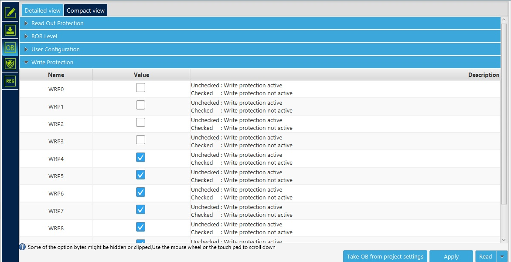
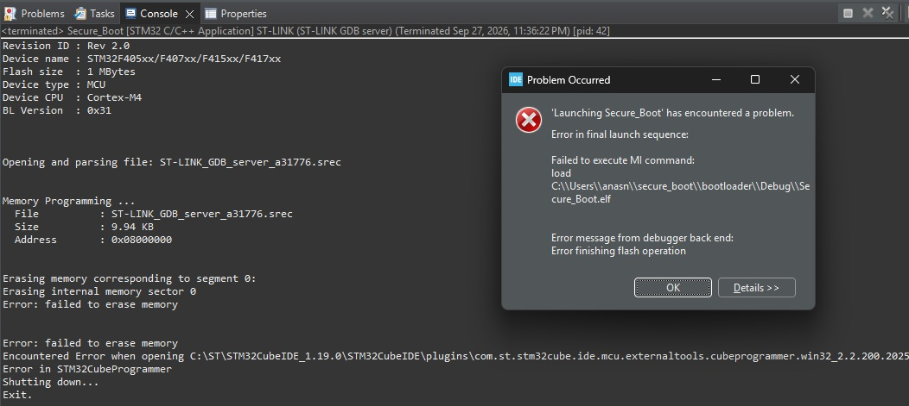

# Design Notes

Decisions taken during implementation, and the reasoning behind them. Recorded
here so the choices are reviewable rather than implicit in the code.

---

## Memory layout

### Bootloader flash capped at 64 KB

The linker script limits the bootloader to sectors 0–3 rather than the full
1 MB. Growth past that boundary becomes a link error instead of silently
overwriting the metadata sector. The cap is enforced now, before SHA-256 and
micro-ecc are linked in, so any future overrun is caught at build time.

If you are wondering why 64? I picked 64 becasue its a round number and the address ends at 0x08010000 and It will make the arithmetic easire.
We could do 32KB (Sector 0-2) but we have 1 MB of total space so we are not going to run out of space anyway.  

### Bootloader heap set to zero

No dynamic allocation in the bootloader. Fragmentation and non-deterministic
allocation latency are very dangerous since the bootloader has no recovery path, and
an allocation failure at boot has nowhere to go.
All buffers are statically sized. Setting the heap to zero also turns any accidental dependency on
`malloc` into a link error.

The application's linker script is independent and unaffected — the bootloader
constrains only itself.

### Application based at 0x08020200, not 0x08020000

The 512-byte offset accommodates the image header while keeping the
application's vector table 512-byte aligned. VTOR bits [8:0] are hardwired to
zero on the Cortex-M4, and the F407 has 98 vectors (392 bytes), which rounds up
to a 512-byte alignment requirement. A 128-byte header would place the vector
table at 0x08020080 and VTOR would silently refuse it — interrupts would then
dispatch through the bootloader's table with no fault to indicate why.

The alignment requirement is asserted in the application's linker script rather
than relied upon:

```ld
ASSERT(ORIGIN(FLASH) % 512 == 0, "App base must be 512-byte aligned for VTOR")
```

---

## Bootloader handoff

The transfer of control does four things in a fixed order, all of them
necessary:

1. **Mask interrupts** (`cpsid i`) — no interrupt may fire while the vector
   table and stack pointer are inconsistent with each other.
2. **De-initialise SysTick** — a timer interrupt during handoff would vector
   through a partially updated table.
3. **Relocate VTOR**, then **adopt the application's MSP** from word 0 of its
   vector table. The bootloader's stack is abandoned at this point; the two
   images share no RAM.
4. **`dsb` / `isb` before the branch** — the write to VTOR must land, and the
   pipeline must be flushed, before execution transfers. Without the barriers
   the branch can execute against a stale vector table. The failure is
   timing-dependent and does not reproduce reliably, which is precisely why the
   barriers are unconditional rather than added in response to a bug.

The branch target is word 1 of the application's vector table — its
`Reset_Handler`, not `main`. The application then runs its own startup: `.data`
copy, `.bss` zero, then `main`. It is a complete standalone program and is
unaware it was launched by a bootloader.

A note on omitting VTOR specifically: the handoff still succeeds without it,
and a polled application appears to run correctly. Only interrupt dispatch
breaks, and only once an interrupt is actually used. An LED blink test does not
exercise this, so the defect would surface much later and in an unrelated
subsystem.

---

## SHA-256

### Implemented from specification rather than imported

Hash functions can be validated exhaustively against published test vectors,
which makes a from-scratch implementation verifiable rather than merely
plausible. ECDSA is a different case — signature verification has
side-channel and input-validation failure modes that testing does not surface —
and a reviewed library (micro-ecc) is used there instead.

### Validating derived constants by regeneration

The round constants K[0..63] are the first 32 bits of the fractional parts of
the cube roots of the first 64 primes; the initial hash values H[0..7] use
square roots of the first 8 primes. Because they are *derived* rather than
arbitrary, they can be recomputed independently and diffed against the
transcribed table.

This matters because a single wrong hex digit produces a digest that is simply
incorrect, with nothing to indicate where the fault lies. Visual proofreading
against the same source page is unreliable — the eye repeats its own error.
Regeneration compares against an independent computation.

This is how the transposed digit in K[53] was located — the NIST vectors
reported a mismatched digest, but not which of 64 constants or four functions
was at fault. The technique generalises to any constant table with a generating
rule: CRC tables, trigonometric lookups, calibration curves.

### Padding buffer sized to the worst case, not runtime

`sha256_final` uses a fixed 72-byte padding buffer rather than a
variable-length array. 72 is the maximum, occurring at `buflen == 56`:
`(120 - 56) + 8`. The bound holds because `sha256_update` drains the buffer at
64 bytes, so `buflen` on entry to `final` is always 0–63.

VLAs are banned by MISRA and were removed from the Linux kernel for the same
reason: stack consumption depends on runtime data, and there is no failure path
to check. Where a worst case can be stated at design time, it should be.

### Streaming interface

`init` / `update` / `final` rather than a single call, because the bootloader
hashes flash in chunks. Stack usage stays flat regardless of image size, and
the hash state lives in a caller-provided context rather than in static storage.

---

## Verification ordering

Checks run cheapest-first: magic number, then image length bounds, then the
SHA-256 comparison, and (from Phase 3) signature verification. Malformed input
is rejected before any expensive computation.

The length field deserves particular attention. It is attacker-controlled data
read from flash, and an unbounded value would cause the bootloader to hash past
the end of the slot. It is validated against the slot size before use.

Every failure path terminates. There is no route from a failed check to the
jump — the refuse path signals and halts rather than returning to a caller that
might proceed.

---

## Rollback protection

A validly signed but older image is refused. Signatures prove who built an
image, not whether it is still safe to run — the counter adds freshness.

**Storage.** Flash sector 4 (`0x08010000`, 64 KB) holds a unary tally: the
stored version is the number of leading `0x00` bytes. Flash programming can
only clear bits, so incrementing means zeroing one more byte — no erase, no
read-modify-write. Capacity: 65,536 increments. App updates never touch
sector 4, so the counter survives them.

**Order of checks.** The version is compared only after the signature
verifies. Before that it is untrusted flash.

**Header fields are signed.** The digest covers `magic, version, img_len,
reserved` as well as the body. An earlier version signed the body only,
which let the version be edited to jump the counter without breaking the
signature.

**Known limitation.** The counter is advanced before handing control to the
application, since the bootloader never runs again afterwards. A new image
that fails at runtime therefore locks out the older working one. The planned
fix is a trial boot: the application confirms it is healthy before the
counter commits, with the MPU preventing the application from writing
sector 4 directly.

---

## Flash Write Protection (WRP) and Readout Protection (RDP)

**Write Protection ->**
In the STM32CubeProgrammer after connecting the board, we move to the OB(Option Byte) section we can enable the Write Protection.
Every section has its onw write Protection. Our bootloader sits in section 0-3 so we enable the Write protection, which will prevent ann modofocation to the bootloader.
This prevents clearing or modification of the sector.



*Figure 1: Selecting the WRP*



*Figure 2: Error on re-flashing the sector 0-3*

**Read Protection ->**
To make sure no one can read the data stored we can enable to readout protection.
Once enabled we cannot uise a debugger to read the contents of the memory. This also disables the use of debugger completely.

To use the debugger again, we would need to remove the protection but we will loose all the data in process.

---

## Testing

`tests/test_sha256.c` runs the 65 NIST CAVS SHA-256 ShortMsg vectors
(0–512 bits), compiled with `-fsanitize=undefined`. This covers the
empty-string case and the 55-/56-byte padding-boundary lengths, but caps
at 64 bytes — the multi-block path in `sha256_update` is not yet tested.

---

## Tooling

AI assistance was used for debugging and code review during development. All
bootloader and cryptographic implementation code is my own. `tests/parser.c` is
AI-generated test-harness support code and is marked as such in that file; no
parser code is compiled into the target image.
